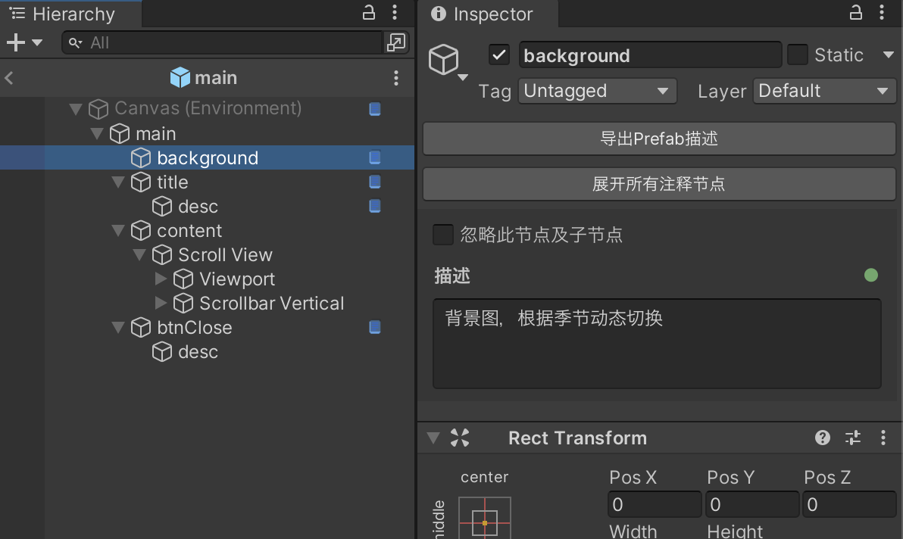

# Prefab Annotator

[](https://unity.com/)
[](CHANGELOG.md)
[](LICENSE.md)

**[English](README_EN.md)**

一款 Unity 编辑器插件，为 Prefab 中的节点添加自然语言注释，并导出带语义描述的结构化文本，让 AI 生成高度贴合业务需求的代码。



## 目录

- [Prefab Annotator](#prefab-annotator)
  - [目录](#目录)
  - [快速开始](#快速开始)
  - [导出示例](#导出示例)
  - [功能特性](#功能特性)
  - [安装方法](#安装方法)
    - [方法 1：通过 Git URL 安装（推荐）](#方法-1通过-git-url-安装推荐)
    - [方法 2：手动添加到 manifest.json](#方法-2手动添加到-manifestjson)
    - [方法 3：本地安装](#方法-3本地安装)
    - [系统要求](#系统要求)
  - [使用方法](#使用方法)
    - [开启/关闭功能](#开启关闭功能)
    - [添加描述](#添加描述)
    - [忽略节点](#忽略节点)
    - [导出结构](#导出结构)
      - [子树剪枝导出](#子树剪枝导出)
    - [复制 Prefab](#复制-prefab)
    - [切换工具菜单语言](#切换工具菜单语言)
  - [优势](#优势)
  - [数据存储](#数据存储)
  - [许可证](#许可证)

## 快速开始

1. **安装** — Package Manager → `Add package from git URL` → 粘贴以下地址：

   ```
   https://github.com/wuchunpeng777/prefab-annotator.git
   ```

2. **标注** — 双击 Prefab 进入编辑模式，在 Inspector 底部输入描述
3. **导出** — 点击「导出 Prefab 描述」，将树形文本交给 AI 生成代码

## 导出示例

~~~
main (Canvas)
├─ background (Image) - 描述：背景图，根据季节动态切换
├─ title - 描述：标题根节点，当活动开启时显示这个节点
│  └─ desc (TextMeshProUGUI) - 描述：标题文字，格式为：xxx活动
├─ content
│  └─ Scroll View (Image, ScrollRect)
│     ├─ Viewport (Image, Mask)
│     │  └─ Content
│     └─ Scrollbar Vertical (Image, Scrollbar)
│        └─ Sliding Area
│           └─ Handle (Image)
└─ btnClose (Button, Image) - 描述：关闭按钮，点击关闭界面
   └─ desc (TextMeshProUGUI)
~~~

## 功能特性

- **节点标注** — 在 Prefab 编辑模式下，为任意 GameObject 添加业务含义描述
- **一键导出** — 导出带节点名、组件类型、层级关系和注释的树形文本（一键复制到剪贴板）
- **子树剪枝导出** — 选中子节点导出时，只导出该节点所在的子树，自动剪枝掉无关分支，大幅减少 token 消耗，适用于 Prefab 局部结构更新场景
- **AI 驱动** — 将导出文本交给 AI，即可生成高度贴合业务需求的代码，告别手写样板代码
- **嵌套 Prefab** — 支持嵌套 Prefab 的注释继承和覆盖
- **Prefab 复制同步** — 复制 Prefab 时自动复制对应的注释文件并关联到新 Prefab，无需重新标注
- **可视化提示** — Hierarchy 窗口显示注释图标和悬停提示
- **节点忽略** — 支持忽略节点及其子节点（导出时自动跳过）

## 安装方法

### 方法 1：通过 Git URL 安装（推荐）

1. 打开 Unity 编辑器
2. 打开 `Window > Package Manager`
3. 点击左上角 `+` 按钮
4. 选择 `Add package from git URL...`
5. 输入以下 URL：

```
https://github.com/wuchunpeng777/prefab-annotator.git
```

6. 点击 `Add` 按钮

### 方法 2：手动添加到 manifest.json

打开项目的 `Packages/manifest.json` 文件，在 `dependencies` 中添加：

```json
{
  "dependencies": {
    "com.firebox.prefab-annotator": "https://github.com/wuchunpeng777/prefab-annotator.git",
    ...
  }
}
```

如需指定版本，可以使用 tag：

```json
"com.firebox.prefab-annotator": "https://github.com/wuchunpeng777/prefab-annotator.git#v1.0.5"
```

### 方法 3：本地安装

1. 下载或克隆此仓库
2. 在 Package Manager 中选择 `Add package from disk...`
3. 选择 `package.json` 文件

### 系统要求

- Unity 2019.4 LTS 或更高版本
- **依赖**: Newtonsoft.Json，安装步骤：
  1. 打开 `Window > Package Manager`
  2. 点击 `+` > `Add package by name`
  3. 输入：`com.unity.nuget.newtonsoft-json`

## 使用方法

### 开启/关闭功能

菜单：`Tools > Prefab Annotator > Enable/Disable`

### 添加描述

1. 双击 Prefab 进入编辑模式
2. 选中任意 GameObject
3. 在 Inspector 底部的描述区域输入内容
4. 点击保存或按 `Ctrl+Enter`

### 忽略节点

勾选 "忽略此节点及子节点" 可以在导出时跳过该节点。

### 导出结构

1. 在 Prefab 编辑模式中，选中任意节点
2. 点击 Inspector 中的「导出 Prefab 描述」按钮，结构文本将复制到剪贴板
3. 将导出的树形文本交给 AI，即可根据注释生成贴合业务需求的代码

#### 子树剪枝导出

当你只需要修改 Prefab 中某个局部区域时，选中该子节点后点击导出，插件会自动裁剪掉不相关的子树，只保留从根节点到选中节点的路径及其完整子树。这在大型 Prefab 中尤其有用——一个拥有数百节点的复杂界面，局部更新时只需导出相关的十几个节点，显著降低提供给 AI 的 token 数量，既节省成本又提高生成精度。

例如，在上方的导出示例中，如果只选中 `content` 节点导出，结果为：

~~~
main (Canvas)
└─ content
   └─ Scroll View (Image, ScrollRect)
      ├─ Viewport (Image, Mask)
      │  └─ Content
      └─ Scrollbar Vertical (Image, Scrollbar)
         └─ Sliding Area
            └─ Handle (Image)
~~~

其他兄弟节点（`background`、`title`、`btnClose`）被自动剪枝，token 消耗大幅降低。

### 复制 Prefab

在 Unity 中复制 Prefab 时，插件会自动检测并复制对应的注释文件（`.desc.json`），将其关联到新 Prefab 的 GUID。无需手动操作，新 Prefab 即刻继承原始 Prefab 的全部注释，可在此基础上继续修改。

### 切换工具菜单语言

菜单：`Tools > Prefab Annotator > Language > Chinese/English`

## 优势

<details>
<summary><strong>与截图方式对比</strong></summary>
<br>

截图方式是指将 Hierarchy 层级结构截图后发给 AI 分析。

| | 截图方式 | Prefab Annotator |
|---|---|---|
| **信息完整度** | AI 通过 OCR 识别节点名，容易漏识、错识，且无法获取组件类型 | 导出精确的节点树，名称、组件类型、层级关系零误差 |
| **业务语义** | 截图只有节点名，AI 只能靠命名猜测用途，歧义大 | 每个节点都有自然语言描述，AI 零歧义地理解业务意图 |
| **代码生成精度** | OCR 可能导致路径拼写错误，组件类型完全缺失，生成代码需大量修正 | 路径和组件类型天然正确，生成代码可直接使用 |
| **层级深度** | 嵌套层级过深时截图难以完整展示，需要多张截图拼接 | 一键导出完整树形结构，无论层级多深都完整呈现 |
| **可维护性** | 每次 UI 变动都要重新截图，截图散落在聊天记录中难以管理 | 注释随 Prefab 一起版本管理，改动即更新 |

</details>

<details>
<summary><strong>与传统开发方式对比</strong></summary>
<br>

| | 传统开发方式 | Prefab Annotator + AI |
|---|---|---|
| **开发效率** | 手动编写节点查找、组件获取、事件绑定等大量样板代码 | 导出结构文本交给 AI，自动生成完整的业务代码 |
| **上手门槛** | 新成员需要逐个节点对照 Prefab 理解 UI 结构 | 打开 Prefab 即可看到每个节点的业务含义 |
| **沟通成本** | 策划/美术/程序之间需要额外文档说明 UI 用途 | 注释直接写在 Prefab 上，所见即所得，无需额外文档 |
| **出错概率** | 节点路径拼写错误、组件类型遗漏等运行时才能发现 | AI 基于精确的结构信息生成代码，路径和类型天然正确 |
| **重复劳动** | 相似界面仍需重新编写大量基础代码 | 描述业务意图即可，AI 处理所有重复性工作 |

</details>

<details>
<summary><strong>与特效师/美术协作场景下的优势</strong></summary>
<br>

在游戏开发中，典型的工作流是：程序员搭建 UI Prefab 并编写逻辑代码，功能开发完成后交给特效师添加粒子特效、动画等表现效果。特效师在此过程中可能新增、调整甚至重组节点结构。这种分工模式下，Prefab Annotator 带来的提升尤为显著：

| | 传统协作流程 | Prefab Annotator + AI |
|---|---|---|
| **特效师理解节点用途** | 特效师拿到 Prefab 后，需要反复询问程序员每个节点的用途和约束 | 程序员在开发时已写好注释，特效师打开 Prefab 即可看到每个节点的业务含义，零沟通成本 |
| **特效师调整后的同步** | 特效师新增/修改节点结构后，程序员需要人肉 diff 找出变更点，手动修改代码 | 导出新的结构描述交给 AI，自动识别差异并更新代码 |
| **局部修改的效率** | 特效师只改了某个子树的结构，程序员仍需通读整棵 Prefab 树确保不遗漏 | 使用子树剪枝导出，只提取变更区域的结构，AI 精准定位修改 |
| **Prefab 变体/复制** | 基于现有界面复制一份做变体，注释丢失，程序员需要从零标注和编写新代码 | 复制 Prefab 时注释自动继承，AI 基于已有注释快速生成变体代码 |
| **跨团队知识传承** | 程序员离职后，Prefab 节点的设计意图和业务逻辑随之丢失，后续维护困难 | 注释持久化在项目中，随版本管理，节点含义永不丢失 |
| **迭代速度** | 每次特效师调整后都是"程序员理解变更 → 手动改代码 → 联调"的漫长循环 | 导出变更区域 → AI 生成代码，迭代周期从小时级缩短到分钟级 |

</details>

<details>
<summary><strong>与 UI 换皮流程对比</strong></summary>
<br>

在活动版本、节日版本或渠道定制版本中，UI 经常需要在保留交互逻辑的前提下进行快速换皮（替换资源、调整层级、增减节点）。Prefab Annotator 在这类高频迭代场景下优势明显：

| | 传统换皮方案 | Prefab Annotator + AI |
|---|---|---|
| **变更定位成本** | 程序员需手动比对新旧 Prefab，逐个确认节点改动 | 选中改动子树后导出，自动剪枝无关节点，AI 聚焦真实变更 |
| **代码同步效率** | 节点路径、组件引用、显隐逻辑需手动改代码并反复联调 | 导出结构描述交给 AI，批量生成/更新绑定与逻辑代码 |
| **注释与语义延续** | 新皮肤 Prefab 复制后通常缺少上下文说明，容易误改 | 复制 Prefab 时注释文件自动继承，业务语义可直接复用 |
| **多人协作成本** | 程序、UI、美术、特效需频繁口头确认节点用途和改动范围 | 注释直接挂在节点上，换皮意图可视化，跨角色沟通显著减少 |
| **回归风险** | 手工改动容易漏改路径或错绑组件，问题常在运行时暴露 | AI 基于完整结构+注释生成代码，路径与类型一致性更高 |
| **版本迭代速度** | 每轮换皮都要重复“比对-改码-联调”流程，周期长 | 变更节点导出即更新，分钟级完成一轮逻辑同步 |

</details>

## 数据存储

描述数据存储在 `Assets/Editor/Descriptions/` 目录下，以 Prefab 的 GUID 命名：
- 格式：`{GUID}.desc.json`
- 移动或重命名 Prefab 不会丢失描述数据

## 许可证

MIT License
