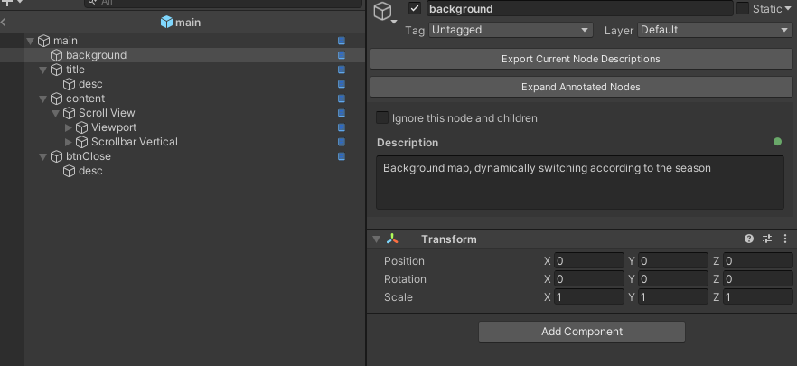

# Prefab Annotator

[](https://unity.com/)
[](CHANGELOG.md)
[](LICENSE.md)

**[中文](README.md)**

A Unity editor extension that adds natural-language annotations to Prefab nodes and exports structured text with semantic descriptions, enabling AI to generate business-ready code.



## Table of Contents

- [Quick Start](#quick-start)
- [Export Example](#export-example)
- [Features](#features)
- [Installation](#installation)
- [Usage](#usage)
  - [Subtree Pruning Export](#subtree-pruning-export)
  - [Copying Prefabs](#copying-prefabs)
- [Advantages](#advantages)
- [Data Storage](#data-storage)
- [License](#license)

## Quick Start

1. **Install** — Package Manager → `Add package from git URL` → paste the URL below:

   ```
   https://github.com/wuchunpeng777/prefab-annotator.git
   ```

2. **Annotate** — Double-click a Prefab to enter edit mode, type a description in the Inspector
3. **Export** — Click "Export Prefab Description", hand the tree text to AI to generate code

## Export Example

~~~
main (Canvas)
├─ background (Image) - Description: Background image, dynamically switches based on season
├─ title - Description: Title root node, displayed when the event is active
│  └─ desc (TextMeshProUGUI) - Description: Title text, format: xxx event
├─ content
│  └─ Scroll View (Image, ScrollRect)
│     ├─ Viewport (Image, Mask)
│     │  └─ Content
│     └─ Scrollbar Vertical (Image, Scrollbar)
│        └─ Sliding Area
│           └─ Handle (Image)
└─ btnClose (Button, Image) - Description: Close button, closes the UI when clicked
   └─ desc (TextMeshProUGUI)
~~~

## Features

- **Node Annotation** — Add business-meaning descriptions to any GameObject in Prefab editing mode
- **One-Click Export** — Export a tree text with node names, component types, hierarchy, and annotations (copied to clipboard)
- **Subtree Pruning Export** — When exporting with a child node selected, only the subtree of that node is exported, automatically pruning unrelated branches to significantly reduce token consumption — ideal for partial Prefab structure updates
- **AI-Driven** — Hand the exported text to AI to generate business-ready code, no more boilerplate
- **Nested Prefabs** — Annotation inheritance and overriding for nested Prefabs
- **Prefab Copy Sync** — Automatically copies the annotation file when duplicating a Prefab, linking it to the new Prefab with no re-annotation needed
- **Visual Indicators** — Annotation icons and hover tooltips in the Hierarchy window
- **Node Ignoring** — Exclude nodes and their children from export

## Installation

### Method 1: Install via Git URL (Recommended)

1. Open Unity Editor
2. Go to `Window > Package Manager`
3. Click the `+` button in the top-left corner
4. Select `Add package from git URL...`
5. Enter the following URL:

```
https://github.com/wuchunpeng777/prefab-annotator.git
```

6. Click `Add`

### Method 2: Add to manifest.json manually

Open `Packages/manifest.json` and add the following under `dependencies`:

```json
{
  "dependencies": {
    "com.firebox.prefab-annotator": "https://github.com/wuchunpeng777/prefab-annotator.git",
    ...
  }
}
```

To specify a version, use a tag:

```json
"com.firebox.prefab-annotator": "https://github.com/wuchunpeng777/prefab-annotator.git#v1.0.5"
```

### Method 3: Local Installation

1. Download or clone this repository
2. In Package Manager, select `Add package from disk...`
3. Choose the `package.json` file

### Requirements

- Unity 2019.4 LTS or higher
- **Dependency**: Newtonsoft.Json — install manually:
  1. Open `Window > Package Manager`
  2. Click `+` > `Add package by name`
  3. Enter: `com.unity.nuget.newtonsoft-json`

## Usage

### Enable / Disable

Menu: `Tools > Prefab Annotator > Enable/Disable`

### Add Description

1. Double-click a Prefab to enter edit mode
2. Select any GameObject
3. Enter the description in the Inspector (bottom section)
4. Click Save or press `Ctrl+Enter`

### Ignore Node

Check "Ignore this node and its children" to exclude it during export.

### Export Structure

1. In Prefab editing mode, select any node
2. Click "Export Prefab Description" in the Inspector — the tree text is copied to clipboard
3. Hand the exported tree text to AI to generate business-ready code based on annotations

#### Subtree Pruning Export

When you only need to modify a specific area of a Prefab, select that child node and click export. The plugin automatically trims unrelated subtrees, keeping only the path from the root to the selected node along with its complete subtree. This is especially useful for large Prefabs — a complex UI with hundreds of nodes can be reduced to just the relevant dozen nodes for a partial update, significantly lowering token consumption for AI, saving cost while improving generation accuracy.

For example, using the export example above, if you select only the `content` node for export, the result is:

~~~
main (Canvas)
└─ content
   └─ Scroll View (Image, ScrollRect)
      ├─ Viewport (Image, Mask)
      │  └─ Content
      └─ Scrollbar Vertical (Image, Scrollbar)
         └─ Sliding Area
            └─ Handle (Image)
~~~

Sibling nodes (`background`, `title`, `btnClose`) are automatically pruned, drastically reducing token consumption.

### Copying Prefabs

When duplicating a Prefab in Unity, the plugin automatically detects the copy and duplicates the corresponding annotation file (`.desc.json`), linking it to the new Prefab's GUID. No manual action needed — the new Prefab instantly inherits all annotations from the original and can be further modified.

### Switch Tool Language

Menu: `Tools > Prefab Annotator > Language > Chinese/English`

## Advantages

<details>
<summary><strong>Compared to Screenshot Approach</strong></summary>
<br>

The screenshot approach means taking screenshots of the Hierarchy and sending them to AI for analysis.

| | Screenshot Approach | Prefab Annotator |
|---|---|---|
| **Information Accuracy** | AI uses OCR to recognize node names — prone to errors, and cannot detect component types | Exports a precise node tree with zero errors in names, component types, and hierarchy |
| **Business Semantics** | Screenshots only show node names; AI can only guess purpose from naming, leading to ambiguity | Each node has a natural-language description; AI understands business intent with zero ambiguity |
| **Code Generation Quality** | OCR may cause path typos, component types are entirely missing, generated code needs heavy fixes | Paths and component types are inherently correct; generated code is ready to use |
| **Deep Hierarchies** | Deeply nested hierarchies are hard to capture in full; multiple screenshots needed | One-click export of the complete tree structure, no matter how deep |
| **Maintainability** | Every UI change requires new screenshots scattered across chat history | Annotations are version-controlled with the Prefab; changes are always in sync |

</details>

<details>
<summary><strong>Compared to Traditional Development</strong></summary>
<br>

| | Traditional Development | Prefab Annotator + AI |
|---|---|---|
| **Development Speed** | Manually write node lookups, component access, event bindings — lots of boilerplate | Export structure text to AI, auto-generate complete business code |
| **Onboarding** | New team members must inspect each node to understand UI structure | Open the Prefab and see the business meaning of every node instantly |
| **Communication Cost** | Designers / artists / developers need extra docs to explain UI purpose | Annotations live on the Prefab — what you see is what you get |
| **Error Rate** | Wrong node paths, missing component types — only discovered at runtime | AI generates code from precise structure info; paths and types are inherently correct |
| **Repetitive Work** | Similar UIs still require rewriting boilerplate from scratch | Describe the business intent; AI handles all the repetitive work |

</details>

<details>
<summary><strong>Advantages in Programmer–VFX Artist Collaboration</strong></summary>
<br>

In game development, a typical workflow is: programmers build the UI Prefab and write logic code, then hand the Prefab to VFX artists to add particle effects, animations, and other visual polish. VFX artists may add, rearrange, or restructure nodes during this process. Prefab Annotator provides significant advantages in this collaborative model:

| | Traditional Workflow | Prefab Annotator + AI |
|---|---|---|
| **VFX Artists Understanding Nodes** | VFX artists receive a Prefab and must repeatedly ask programmers about each node's purpose and constraints | Programmers annotate during development; VFX artists open the Prefab and instantly see the business meaning of every node — zero communication overhead |
| **Syncing After VFX Changes** | After VFX artists add/modify node structures, programmers must manually diff to find changes and update code by hand | Export the new structure description to AI, which automatically identifies differences and updates the code |
| **Efficiency of Partial Changes** | VFX artists only changed a subtree, but programmers still need to review the entire Prefab tree to avoid missing anything | Use subtree pruning export to extract only the changed region; AI pinpoints the exact modifications |
| **Prefab Variants / Copies** | Duplicating a Prefab for a variant loses all annotations; programmers must re-annotate and rewrite code from scratch | Annotations are auto-inherited on copy; AI quickly generates variant code based on existing annotations |
| **Cross-Team Knowledge Retention** | When programmers leave, the design intent and business logic behind Prefab nodes is lost, making maintenance difficult | Annotations persist in the project under version control; node meanings are never lost |
| **Iteration Speed** | Every VFX adjustment triggers a slow cycle of "programmer understands changes → manually updates code → joint debugging" | Export the changed region → AI generates code; iteration cycles shrink from hours to minutes |

</details>

## Data Storage

Description data is stored under `Assets/Editor/Descriptions/`, named using the Prefab GUID:
- Format: `{GUID}.desc.json`
- Moving or renaming a Prefab will not lose description data

## License

MIT License
